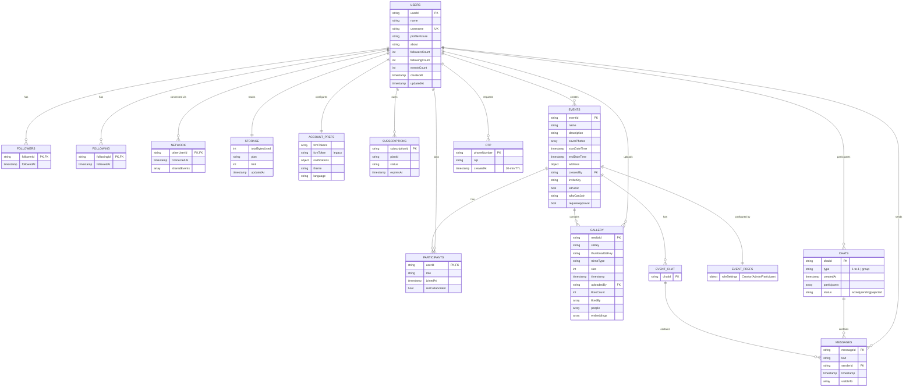

# Momento Database — ER Diagram

Source: [ARCHITECTURE.md](ARCHITECTURE.md#L252-L293) Firestore schema.

## Notes

- Firestore is document-based; "FK" relationships are by document ID convention, not enforced.
- Subcollections under `users/{userId}`: `followers`, `following`, `network`, `storage`, `accountPreferences`, `subscriptions`.
- Subcollections under `events/{eventId}`: `participants`, `gallery`, `chat`, `eventPreferences`.
- Face embeddings on gallery media are mirrored to Qdrant (external vector DB), not Firestore.
- `network` is bidirectional — auto-created via `onParticipantJoinedNetwork` trigger when users share an event.
